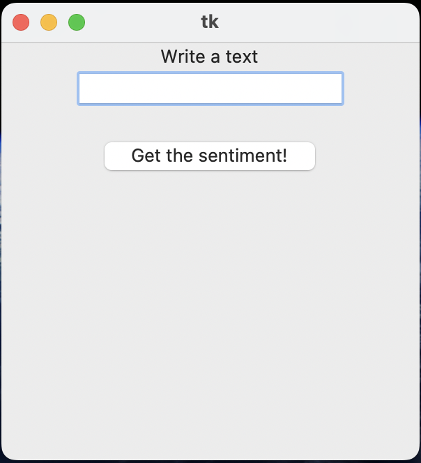
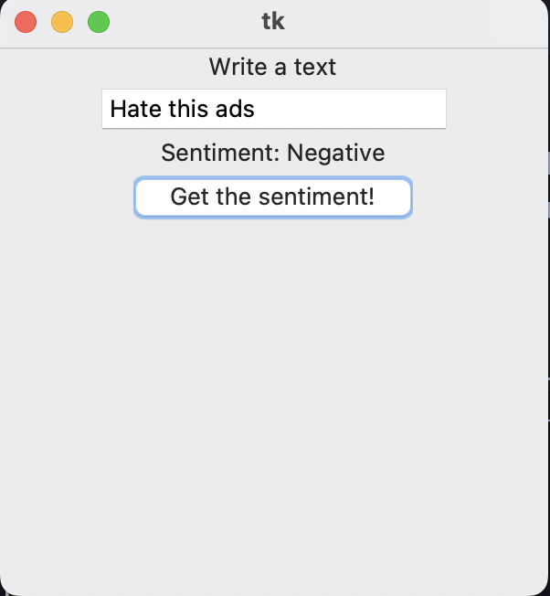

# sentiment-analysis-BoW

## Introduction

sentiment-analysis-BoW is a python application that analysis sentiment of given entry. There are three sentiments that are supported, respect to the dataset, which are Positive, Negative, and Neutral. The model used in this application has been created and trained from scratch by using the [twitter dataset](https://www.kaggle.com/datasets/jp797498e/twitter-entity-sentiment-analysis) on [kaggle](https://www.kaggle.com/). This datasets contains collection of tweets collected from twitter, X with its new name, and their corresponding sentiments.

Each tweet are processed by removing stop words and lemmatization.

The algorithm associates a vector with a sample. The vector has dimentionality that equals to the size of vocabulary, where vocabulary is the set of words in the training corpus. And each index of the vector is associated with a word in vocabulary. For a sample text/tweet we count each word in vocabulary and assign the counts to corresponding indices of the vector. At the end, we use vector of counts of words that are exists in vocabulary for a sample as input for our machine learning model. This techique is called Bag of Words. 

To find the model best fits to this task, I test three machiine learning algorithms which are Random Forest, KNN, and Naive Bayes. I've tested and compared these three machine learning algorithms by using GridSearch Algorithm which is a greedy algorithm tries all given algorithms with given combination of parameters to find the best one. More information is available on the documentation website of [sklearn](https://scikit-learn.org/1.5/modules/generated/sklearn.model_selection.GridSearchCV.html#sklearn.model_selection.GridSearchCV).

The best model for this project became the RandomForest algorithm with score: 0.92, where the score 1 is the maximum score. It also achived 0.94 test accuracy score and 0.97 validation accuracy.


## Installation


Install the dataset from this [link](https://www.kaggle.com/datasets/jp797498e/twitter-entity-sentiment-analysis) and store them in a directory which is called dataset


**Important:** This project is developed and test with python version 3.10. Some packages that used in this project may not work properly with later python versions


In order to prevent this, I highly recommand to create a virtual environment with python version 3.10 as below


### Creating virtual environment

```python3.10 -m venv virtual-env```

```source virtual-env/bin/activate```


### Installing necessary libraries

```pip3 install -r requirements.txt``` 

```python3 -m spacy download en_core_web_sm```


## Preprocessing & Training the model

1. Run all cells of preprocessing.ipynb

2. Run all cell of training_model.ipynb


The generated model will be stored in a pickle file which is called the_model.pkl


## Application Overview


When everything is installed and ready, you can simply run the application by the command

```python3 app.py```

After you run the command above, you should see the initial gui of the app as below




When you enter your entry and you hit the button *Get the sentiment!*, you will see the predicted sentiment above the button as follows




